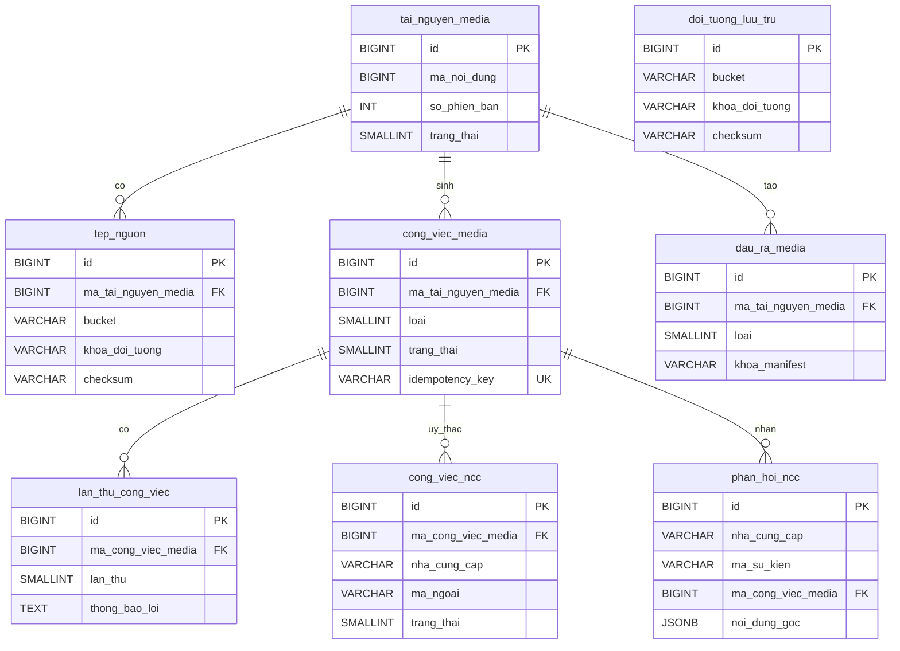

```mermaid
erDiagram
    tai_nguyen_media ||--o{ tep_nguon : "co"
    tai_nguyen_media ||--o{ cong_viec_media : "sinh"
    tai_nguyen_media ||--o{ dau_ra_media : "tao"
    cong_viec_media ||--o{ lan_thu_cong_viec : "co"
    cong_viec_media ||--o{ cong_viec_ncc : "uy_thac"
    cong_viec_media ||--o{ phan_hoi_ncc : "nhan"

    tai_nguyen_media {
        BIGINT id PK
        BIGINT ma_noi_dung
        INT so_phien_ban
        SMALLINT trang_thai
    }
    tep_nguon {
        BIGINT id PK
        BIGINT ma_tai_nguyen_media FK
        VARCHAR bucket
        VARCHAR khoa_doi_tuong
        VARCHAR checksum
    }
    cong_viec_media {
        BIGINT id PK
        BIGINT ma_tai_nguyen_media FK
        SMALLINT loai
        SMALLINT trang_thai
        VARCHAR idempotency_key UK
    }
    lan_thu_cong_viec {
        BIGINT id PK
        BIGINT ma_cong_viec_media FK
        SMALLINT lan_thu
        TEXT thong_bao_loi
    }
    cong_viec_ncc {
        BIGINT id PK
        BIGINT ma_cong_viec_media FK
        VARCHAR nha_cung_cap
        VARCHAR ma_ngoai
        SMALLINT trang_thai
    }
    phan_hoi_ncc {
        BIGINT id PK
        VARCHAR nha_cung_cap
        VARCHAR ma_su_kien
        BIGINT ma_cong_viec_media FK
        JSONB noi_dung_goc
    }
    dau_ra_media {
        BIGINT id PK
        BIGINT ma_tai_nguyen_media FK
        SMALLINT loai
        VARCHAR khoa_manifest
    }
    doi_tuong_luu_tru {
        BIGINT id PK
        VARCHAR bucket
        VARCHAR khoa_doi_tuong
        VARCHAR checksum
    }
```