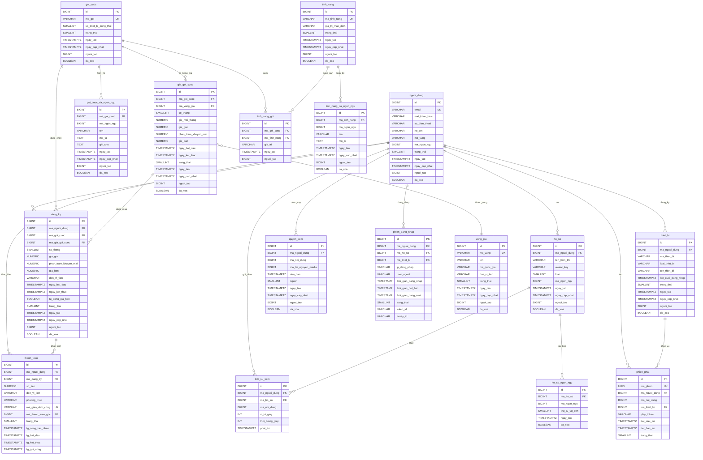

```mermaid
erDiagram
    nguoi_dung ||--o{ ho_so : "co"
    nguoi_dung ||--o{ thiet_bi : "dang_ky"
    nguoi_dung ||--o{ dang_ky : "so_huu"
    nguoi_dung ||--o{ thanh_toan : "thuc_hien"
    nguoi_dung ||--o{ quyen_xem : "duoc_cap"
    nguoi_dung ||--o{ phien_phat : "tao"
    nguoi_dung ||--o{ lich_su_xem : "ghi_nhan"
    nguoi_dung ||--o{ phien_dang_nhap : "dang_nhap"

    ho_so ||--o{ lich_su_xem : "phat"
    ho_so ||--o{ ho_so_ngon_ngu : "uu_tien"

    goi_cuoc ||--o{ goi_cuoc_da_ngon_ngu : "hien_thi"
    goi_cuoc ||--o{ gia_goi_cuoc : "co_bang_gia"
    goi_cuoc ||--o{ tinh_nang_goi : "gom"
    gia_goi_cuoc }o--|| vung_gia : "thuoc_vung"
    tinh_nang ||--o{ tinh_nang_goi : "duoc_gan"
    tinh_nang ||--o{ tinh_nang_da_ngon_ngu : "hien_thi"

    goi_cuoc ||--o{ dang_ky : "duoc_chon"
    gia_goi_cuoc ||--o{ dang_ky : "duoc_mua"
    dang_ky ||--o{ thanh_toan : "phat_sinh"

    thiet_bi ||--o{ phien_phat : "phuc_vu"

    nguoi_dung {
        BIGINT id PK
        VARCHAR email UK
        VARCHAR mat_khau_hash
        VARCHAR so_dien_thoai
        VARCHAR ho_ten
        VARCHAR ma_vung
        BIGINT ma_ngon_ngu
        SMALLINT trang_thai
        TIMESTAMPTZ ngay_tao
        TIMESTAMPTZ ngay_cap_nhat
        BIGINT nguoi_tao
        BOOLEAN da_xoa
    }

    ho_so {
        BIGINT id PK
        BIGINT ma_nguoi_dung FK
        VARCHAR ten_hien_thi
        VARCHAR avatar_key
        SMALLINT loai
        BIGINT ma_ngon_ngu
        TIMESTAMPTZ ngay_tao
        TIMESTAMPTZ ngay_cap_nhat
        BIGINT nguoi_tao
        BOOLEAN da_xoa
    }

    ho_so_ngon_ngu {
        BIGINT id PK
        BIGINT ma_ho_so FK
        BIGINT ma_ngon_ngu
        SMALLINT thu_tu_uu_tien
        TIMESTAMPTZ ngay_tao
        BOOLEAN da_xoa
    }

    thiet_bi {
        BIGINT id PK
        BIGINT ma_nguoi_dung FK
        VARCHAR ma_thiet_bi
        VARCHAR loai_thiet_bi
        VARCHAR ten_thiet_bi
        TIMESTAMPTZ lan_cuoi_dang_nhap
        SMALLINT trang_thai
        TIMESTAMPTZ ngay_tao
        TIMESTAMPTZ ngay_cap_nhat
        BIGINT nguoi_tao
        BOOLEAN da_xoa
    }

    goi_cuoc {
        BIGINT id PK
        VARCHAR ma_goi UK
        SMALLINT so_thiet_bi_dong_thoi
        SMALLINT trang_thai
        TIMESTAMPTZ ngay_tao
        TIMESTAMPTZ ngay_cap_nhat
        BIGINT nguoi_tao
        BOOLEAN da_xoa
    }

    goi_cuoc_da_ngon_ngu {
        BIGINT id PK
        BIGINT ma_goi_cuoc FK
        BIGINT ma_ngon_ngu
        VARCHAR ten
        TEXT mo_ta
        TEXT ghi_chu
        TIMESTAMPTZ ngay_tao
        TIMESTAMPTZ ngay_cap_nhat
        BIGINT nguoi_tao
        BOOLEAN da_xoa
    }

    vung_gia {
        BIGINT id PK
        VARCHAR ma_vung UK
        VARCHAR ten
        VARCHAR ma_quoc_gia
        VARCHAR don_vi_tien
        SMALLINT trang_thai
        TIMESTAMPTZ ngay_tao
        TIMESTAMPTZ ngay_cap_nhat
        BIGINT nguoi_tao
        BOOLEAN da_xoa
    }

    gia_goi_cuoc {
        BIGINT id PK
        BIGINT ma_goi_cuoc FK
        BIGINT ma_vung_gia FK
        SMALLINT so_thang
        NUMERIC gia_moi_thang
        NUMERIC gia_goc
        NUMERIC phan_tram_khuyen_mai
        NUMERIC gia_ban
        TIMESTAMPTZ ngay_bat_dau
        TIMESTAMPTZ ngay_ket_thuc
        SMALLINT trang_thai
        TIMESTAMPTZ ngay_tao
        TIMESTAMPTZ ngay_cap_nhat
        BIGINT nguoi_tao
        BOOLEAN da_xoa
    }

    tinh_nang {
        BIGINT id PK
        VARCHAR ma_tinh_nang UK
        VARCHAR gia_tri_mac_dinh
        SMALLINT trang_thai
        TIMESTAMPTZ ngay_tao
        TIMESTAMPTZ ngay_cap_nhat
        BIGINT nguoi_tao
        BOOLEAN da_xoa
    }

    tinh_nang_da_ngon_ngu {
        BIGINT id PK
        BIGINT ma_tinh_nang FK
        BIGINT ma_ngon_ngu
        VARCHAR ten
        TEXT mo_ta
        TIMESTAMPTZ ngay_tao
        TIMESTAMPTZ ngay_cap_nhat
        BIGINT nguoi_tao
        BOOLEAN da_xoa
    }

    tinh_nang_goi {
        BIGINT id PK
        BIGINT ma_goi_cuoc FK
        BIGINT ma_tinh_nang FK
        VARCHAR gia_tri
        TIMESTAMPTZ ngay_tao
        BIGINT nguoi_tao
    }

    dang_ky {
        BIGINT id PK
        BIGINT ma_nguoi_dung FK
        BIGINT ma_goi_cuoc FK
        BIGINT ma_gia_goi_cuoc FK
        SMALLINT so_thang
        NUMERIC gia_goc
        NUMERIC phan_tram_khuyen_mai
        NUMERIC gia_ban
        VARCHAR don_vi_tien
        TIMESTAMPTZ ngay_bat_dau
        TIMESTAMPTZ ngay_ket_thuc
        BOOLEAN tu_dong_gia_han
        SMALLINT trang_thai
        TIMESTAMPTZ ngay_tao
        TIMESTAMPTZ ngay_cap_nhat
        BIGINT nguoi_tao
        BOOLEAN da_xoa
    }

    thanh_toan {
        BIGINT id PK
        BIGINT ma_nguoi_dung FK
        BIGINT ma_dang_ky FK
        NUMERIC so_tien
        VARCHAR don_vi_tien
        VARCHAR phuong_thuc
        VARCHAR ma_giao_dich_cong UK
        BIGINT ma_thanh_toan_goc FK
        SMALLINT trang_thai
        TIMESTAMPTZ tg_cong_xac_nhan
        TIMESTAMPTZ tg_bat_dau
        TIMESTAMPTZ tg_ket_thuc
        TIMESTAMPTZ tg_gui_cong
    }

    quyen_xem {
        BIGINT id PK
        BIGINT ma_nguoi_dung FK
        BIGINT ma_noi_dung
        BIGINT ma_tai_nguyen_media
        TIMESTAMPTZ den_han
        SMALLINT nguon
        TIMESTAMPTZ ngay_tao
        TIMESTAMPTZ ngay_cap_nhat
        BIGINT nguoi_tao
        BOOLEAN da_xoa
    }

    phien_phat {
        BIGINT id PK
        UUID ma_phien UK
        BIGINT ma_nguoi_dung FK
        BIGINT ma_noi_dung
        BIGINT ma_thiet_bi FK
        VARCHAR play_token
        TIMESTAMPTZ bat_dau_luc
        TIMESTAMPTZ het_han_luc
        SMALLINT trang_thai
    }

    lich_su_xem {
        BIGINT id PK
        BIGINT ma_nguoi_dung FK
        BIGINT ma_ho_so FK
        BIGINT ma_noi_dung
        INT vi_tri_giay
        INT thoi_luong_giay
        TIMESTAMPTZ phat_luc
    }

    phien_dang_nhap {
        BIGINT id PK
        BIGINT ma_nguoi_dung FK
        BIGINT ma_ho_so FK
        BIGINT ma_thiet_bi FK
        VARCHAR ip_dang_nhap
        VARCHAR user_agent
        TIMESTAMP thoi_gian_dang_nhap
        TIMESTAMP thoi_gian_het_han
        TIMESTAMP thoi_gian_dang_xuat
        SMALLINT trang_thai
        VARCHAR token_id 
        VARCHAR family_id
    }
```